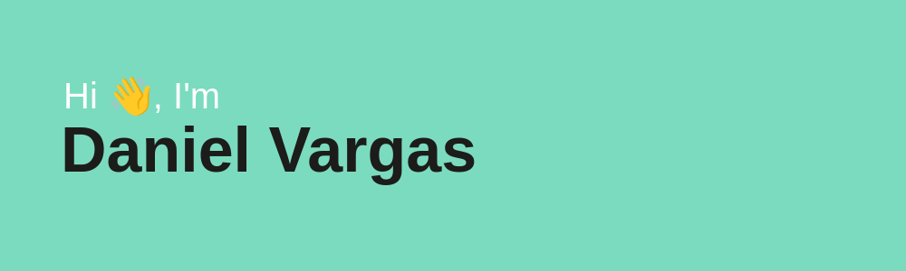

<!-- https://github.com/ikatyang/emoji-cheat-sheet/blob/master/README.md -->

<!-- https://reheader.glitch.me/ -->

# 

## 🧑‍💻 About me

I'm a Web Developer, focus in Frontend 🖥️

I like repair things, maybe cause I broke a lot 🙃

🌱 I’m currently learning to make art with code (P5.js)

---

## Skills

### My tops

| Rank | Languages                                                                                                           | Frameworks                                                                                                     | Libraries                                                                                                      | IDEs                                                                                                                  |
| :--: | ------------------------------------------------------------------------------------------------------------------- | -------------------------------------------------------------------------------------------------------------- | -------------------------------------------------------------------------------------------------------------- | --------------------------------------------------------------------------------------------------------------------- |
|  1   |   |        |                 |  |
|  2   |    |       |  |          |
|  3   |                    |             |                 |         |
|  4   |                       |  |     |
|  5   |  |          |
|  6   |                         |

<!-- | Tools      |
| ---------- |
| Git        |
| NX         |
| Jest       |
| Serverless |
| Linux      | -->

<!-- 

 I want learn about 

| Languages | Libraries |
| --------- | --------- |
|           |           |

 -->

### Code

#### Time coding

#### Tanks for read me

Here goes a Dev joke to you

<!-- https://github.com/ABSphreak/readme-jokes -->

---

Time to continue coding...

<!-- https://github.com/devicons/devicon/ -->

<!-- https://github.com/antonkomarev/github-profile-views-counter
 -->

<!-- https://shields.io/ -->

<!-- https://github.com/omidnikrah/github-readme-stackoverflow
 -->

<!-- (https://github.com/anuraghazra/github-readme-stats) -->
<!--  -->
<!--  -->
<!--  -->

<!-- (https://git.io/streak-stats) -->
<!--  -->

<!-- https://github.com/omidnikrah/github-readme-medium -->
<!-- ] -->

<!-- Resources to improve our profile readme -->

<!-- https://github.com/soroushchehresa/github-readme-linkedin -->
<!-- https://github.com/jojoee/jojoee -->
<!-- https://github.com/pujux/git-badges -->
<!-- https://github.com/jwenjian/visitor-badge -->
<!-- https://github.com/simple-icons/simple-icons#cdn-usage -->
<!-- https://github.com/alexandresanlim/Badges4-README.md-Profile -->

<!--
**Ebriopes/Ebriopes** is a ✨ _special_ ✨ repository because its `README.md` (this file) appears on your GitHub profile.

Here are some ideas to get you started:

- 🔭 I’m currently working on ...
- 🌱 I’m currently learning ...
- 👯 I’m looking to collaborate on ...
- 🤔 I’m looking for help with ...
- 💬 Ask me about ...
- 📫 How to reach me: ...
- 😄 Pronouns: ...
- ⚡ Fun fact: ...
-->
